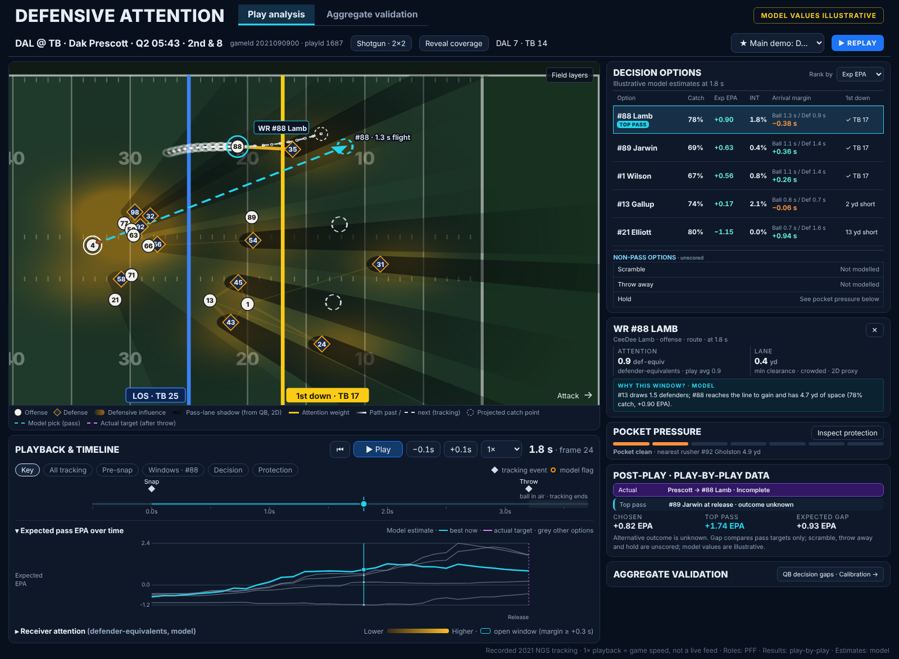
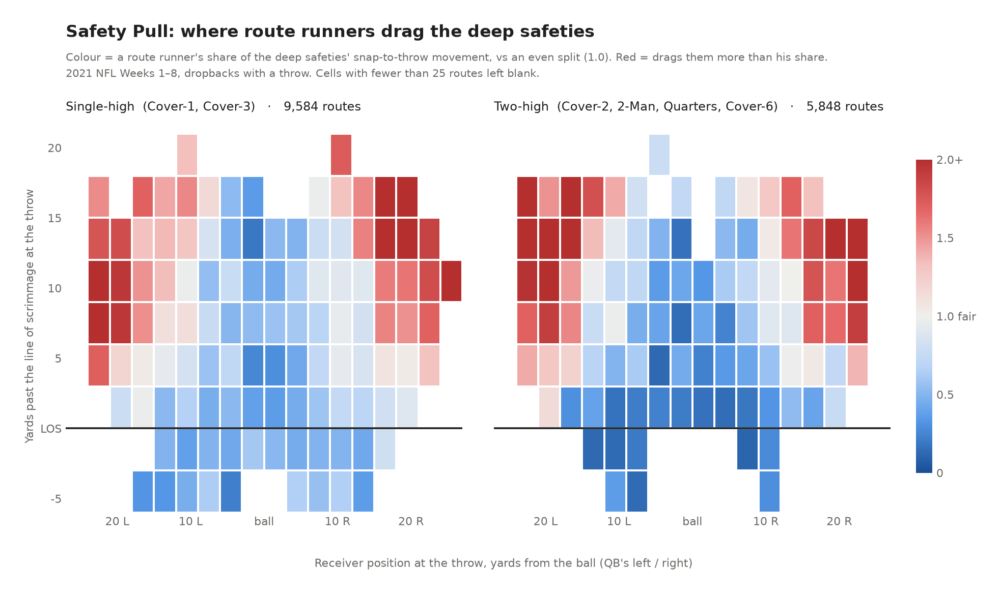
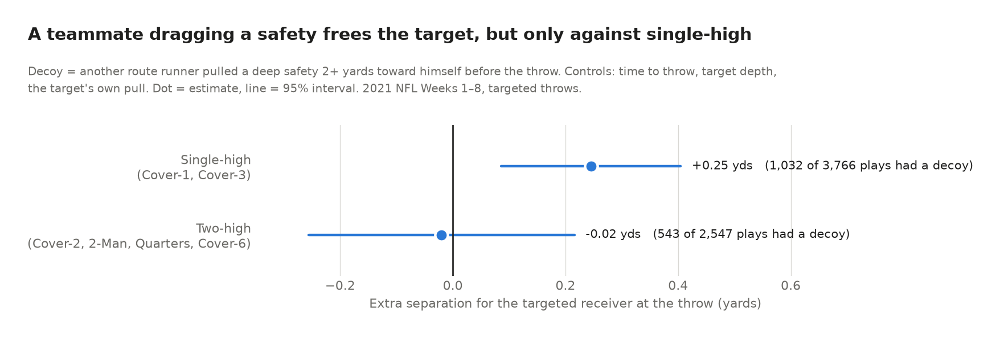
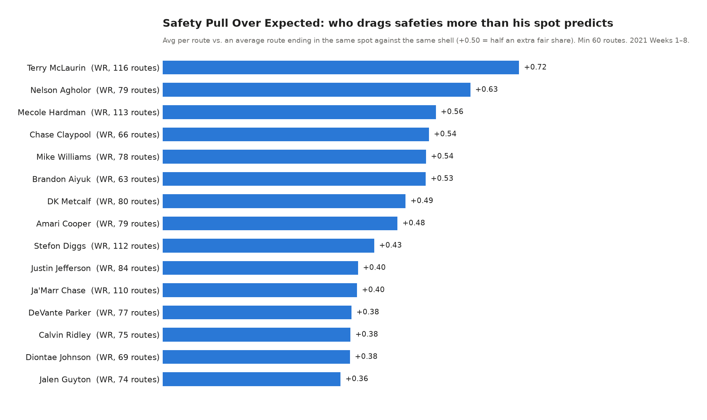

# Attention is all you need

Defensive Attention is a web app that replays 2021 NFL passing plays (Weeks 1–8 player tracking) from snap to throw, estimating how much defensive attention each offensive player draws and ranking every pass option frame by frame by catch probability and expected points. It reveals which receivers pull the deep safeties away from their teammates (outside receivers 8–18 yards downfield draw up to twice their fair share, and against single-high coverage that pull comes with +0.25 yards of separation and +4 points of completion rate for the targeted receiver) and where the quarterback's throw differed from the model's best option at release. Coaches can use it to design decoy routes and review a quarterback's reads, scouts to find receivers whose value never shows up in their own stats, and broadcasters to show viewers who opened the play.



> **For judges:** the summary above is our submission. Everything below is setup and technical reference, so it's optional.

The specs and build prompts are in [`docs/`](docs/README.md). Start with `docs/00_PROJECT_BRIEF.md`.

## Quick start

The bundled demo works without downloading or processing the dataset. You need [Node.js](https://nodejs.org) 20 or newer. On Windows, double-click `run-demo.cmd`; on macOS or Linux, run `./run-demo.sh`. Either script installs the app's packages on the first run and opens the browser. By hand:

```bash
cd app
npm ci
npm run dev
```

Open the local URL printed by Vite. Pick one of the three starred plays. **1× playback follows the recorded 10 Hz frames at game speed; it is not a live NFL feed.** The app includes six play replays and aggregate validation for 7,282 eligible targeted throws.

## Demo in 60 seconds

1. Open the starred **DAL @ TB** play and pause near **1.8 s**. Point to the yellow attention edges and the ranked pass options beside the field.
2. Play through the throw. Prescott targeted Lamb #88 and the pass was incomplete; the model ranks Jarwin #89 highest at release. The alternative outcome is unknown.
3. Open **Aggregate validation** to show how the pass model performs across eligible throws, including held-out completion calibration.

The timed two-minute recording script is [docs/DEMO_SCRIPT.md](docs/DEMO_SCRIPT.md).

## Regenerate the data

To regenerate both play data and aggregate validation from the source dataset, run from the repo root:

```bash
# Get the data (about 1 GB, cloned into data/raw; re-running is a no-op)
bash scripts/get_data.sh
python -m pipeline.normalise
python -m pipeline.targets --no-ball
python -m pipeline.export
python -m pipeline.aggregate
```

`python -m pipeline.export` writes the demo set (the three spec demo plays plus the three `pass_options.py` showcase plays) to `app/public/data`. The six play files and `aggregate.json` are bundled, so the app runs without the pipeline. Use `--plays 2021090900:1687 ...` or `--games 2021090900` for other plays.

The app includes:

- **Field layers** (open **Field layers** at the upper-right of the field): heatmap (defense influence, or offense vs defense), pass-lane shadows (the cone behind each defender as seen from the QB, 2D), attention edges, movement trails (click a player: past frames solid, next frames dashed; length ±0.5 to ±3 s, or all players), +0.5 s projection, projected catch points with per-receiver flight time, and the actual target path. Layer choices are remembered in the browser.
- **Pass options** ranked by expected EPA, or by the `pass_options.py` expected yards / safest throw. Catch % comes from the team's completion model (`passOptions.ts`, ported to `pipeline/completion.py`); EPA uses that catch % with the pipeline's EP values. Arrival margin comes from the arrival model.
- **Timeline**: snap/throw and model flags with filter chips, expected pass EPA chart, receiver attention strips with open windows, playback at 0.25-2x.
- **Aggregate validation**: QB pass-target decision gaps with 90% bootstrap intervals (at least 50 eligible throws per QB), weeks 7-8 completion calibration, Man/Zone attention sanity, and projected catch locations. All charts state their sample and model scope.
- Keys: Space play/pause, ←/→ one frame, Shift+←/→ five frames, `[` `]` previous/next visible flag, Home/End, Esc clears the selection. Deep links: `?game=2021090900&play=1687&frame=24&sel=52425`.

**What the demo can claim:** recorded player positions and observed play outcomes come from the event data. Attention, projected catch points, completion probability and expected EPA are model estimates. The mockup's Wilson pick is illustrative: this export ranks Jarwin #89 as the top pass at release on play 1687. Scramble, throw away and hold have no comparable EPA estimate yet, so decision gaps cover pass targets only. Alternative outcomes are unknown.

The stages also run on their own:

```bash
bash scripts/get_nflverse.sh      # optional: nflverse 2021 play-by-play (20 MB) into data/external
python -m pipeline.normalise      # data/derived/play_index.parquet (key frames, labels, formation)
python -m pipeline.targets        # data/derived/targets.parquet (actual target per play)
python -m pipeline.validate_attention   # attention checks and grid search (P04, ~3 min)
python -m pipeline.arrival        # arrival model report (P05, ~3 min)
python -m pipeline.values         # option values report (P06, ~3 min)
python -m pipeline.export         # per-play JSON for the app (demo set, a few seconds)
```

## Setup

Python 3.10+ (3.11+ recommended):

```bash
python -m venv .venv
# macOS/Linux: source .venv/bin/activate    Windows: .venv\Scripts\activate
pip install -e ".[dev]"
pytest
```

Node 20+ for the app (`npm test`, `npm run lint`, `npm run build`).

On Windows, run `scripts/get_data.sh` from Git Bash. Tests that need the data are marked `data` and skip when `data/raw` is missing. Set `NFL_DATA_DIR` to point at a copy of the CSVs stored elsewhere.

## Layout

```
pipeline/   Python package: load, normalise, targets, attention, arrival, values, lanes, flags, export
  config.yaml   every model parameter with its starting value
  tests/
app/        React 18 + Vite + TypeScript
  src/{data,field,panels,timeline,validation}
  public/data/  pipeline output
scripts/    get_data.sh, get_nflverse.sh
docs/       project brief, specs, build and review prompts, mockups
data/       raw/ (cloned), derived/ (pipeline intermediates), external/ (optional nflverse files); not committed
```

## Safety Pull analysis

The existing `safety_pull.py` analysis measures how much of the deep safeties' movement between the snap and the throw each route runner draws toward himself—the decoy work that never appears in a box score. Across 7,541 throws from Weeks 1–8 of the 2021 season, outside receivers 8–18 yards downfield drag the safeties up to twice their fair share. Against a single-high shell, a teammate who pulls a safety 2+ yards gives the targeted receiver +0.25 yards of separation and about +4 points of completion rate, while against two-high shells the effect is zero because the second safety is still there.





### How it works

- **Deep safeties:** players in a safety alignment (PFF `FS`/`SS` variants) who line up at least 7 yards deep at the snap.
- **Pull:** on every frame from the snap to the throw, the safety's own movement toward each route runner is measured. The route runner he moves toward most gets the credit, so receiver movement doesn't count.
- **Safety Pull index:** a route runner's share of that movement multiplied by the number of route runners on the play. 1.0 is an even split.
- **Pull Over Expected:** the heatmap is the expected-pull model. A receiver's index minus the average index for routes ending in the same 3×3-yard cell against the same shell gives his own contribution. This follows the same logic as the NBA's Gravity stat.
- **Decoy effect:** OLS regression, separately for each shell. The targeted receiver's separation at the throw is regressed on whether a teammate pulled a safety 2+ yards, controlling for time to throw, target depth, and the target's own pull.
- **Intended receiver:** parsed from the play description because tracking ends 0.5 seconds after the throw. This matches 93% of plays.

### Run Safety Pull

```bash
python safety_pull.py --data <folder with games.csv, plays.csv, tracking/...> --out output
```

Requires `pandas`, `numpy`, and `matplotlib`. The full run takes about 2 minutes. `--weeks 1` gives a quick test, and `--plot-only` redraws from saved results.

### Limitations

- In zone coverage, safeties widen to their deep areas regardless of the receiver. Pull Over Expected controls for this by spot and shell, but not by play call.
- A safety may react to the QB's eyes rather than the receiver.
- The decoy effect is an association with controls, not a causal estimate.
